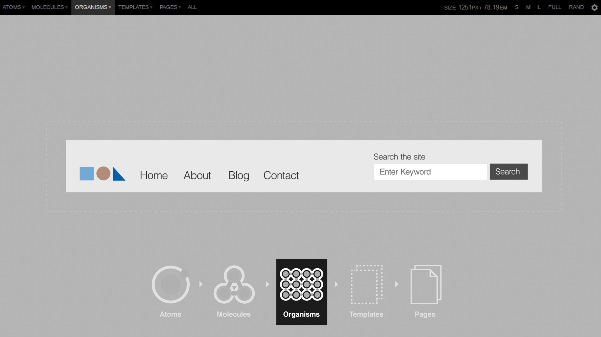
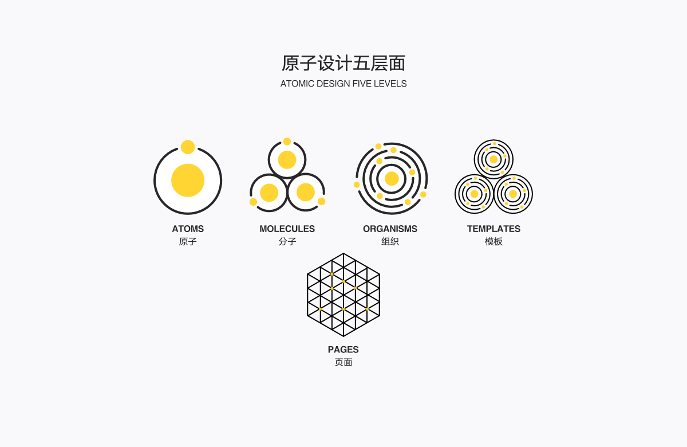
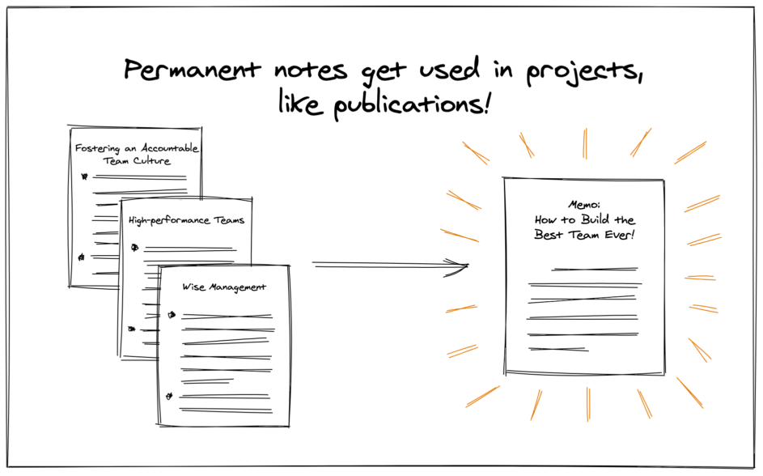
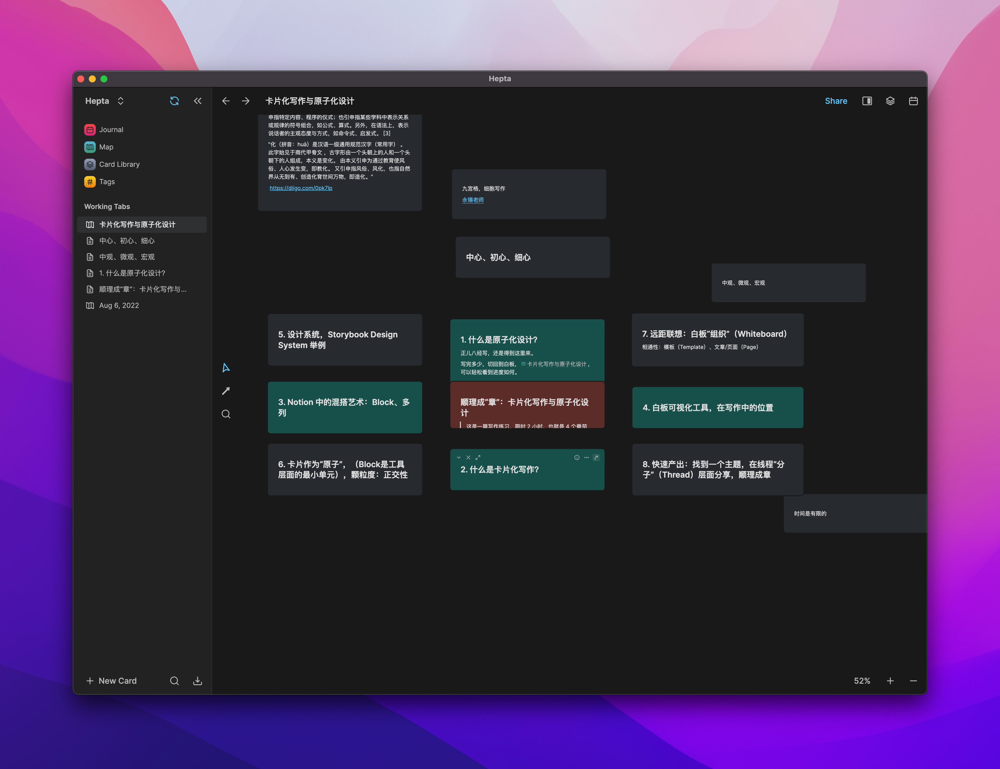
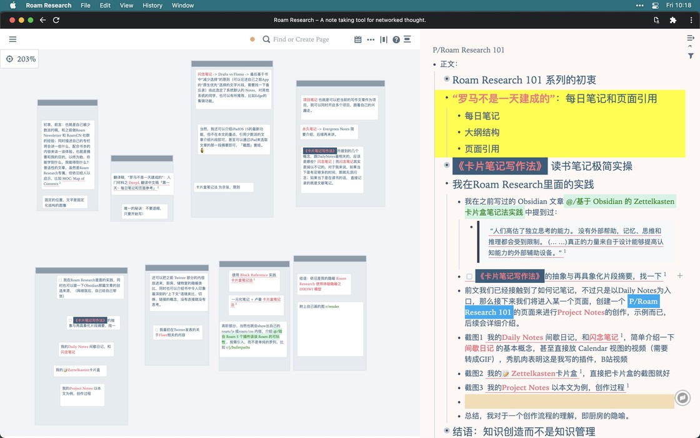
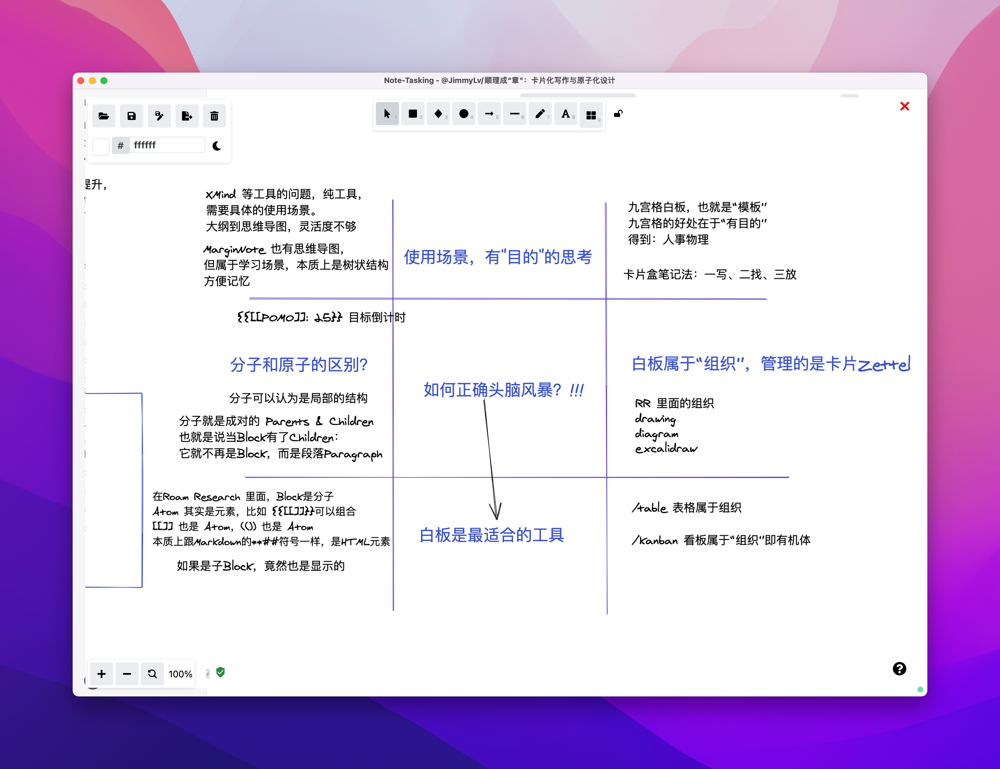
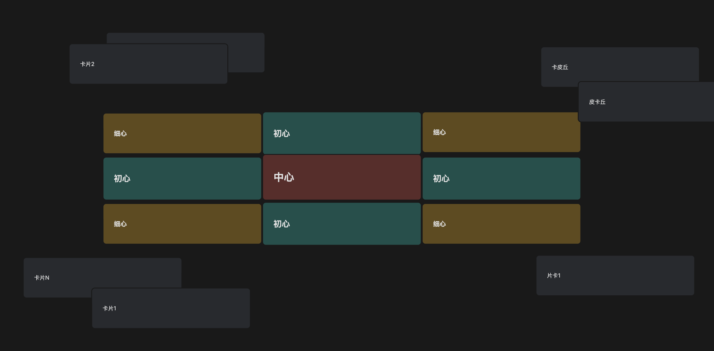

# 顺理成“章”：卡片化写作与原子设计

## 前言：卡片颗粒度到底有多大？

这篇文章试图回答一个问题，一直以来我都非常困惑的一个问题—— 卡片的颗粒度到底该有多大？

**我一直比较纠结在写一张卡片或 block 时，压根不知道字数多少才合适。**比方说有些人以 140 个字，即微博能够发的字数作为自己卡片的限制。也有人说卡片不需要有任何的限制，你可以写一下自己任意的内容任意的想法。那么这篇文章就是我对卡片颗粒度的一次探索。

本文的标题包含了原子设计和卡片化写作，我会向你逐一介绍它们以及二者之间的远距离联系。但什么叫顺理成“章”呢？我还是先来卖关子，答案在文章最后揭晓。

## 1. 什么是原子设计？

首先给大家介绍一下「原子设计」。原子设计（Atomic Design）是一个设计理论，用来构建科学规范的设计系统。原子设计理论可以用来帮助软件工程师构建自己的组件库，并且**使用组件的思维方式去与设计师和业务伙伴进行沟通**。相应地，我也在思考，怎么样用卡片式的写作理念来加速我们的高效产出。

首先来看一个视频，最直观地展现什么是 Atomic Design，简单来说，一个个原子（Atoms）元素共同组成分子（Molecules），比如视频中的输入框。当输入框放到 Header 即网页的顶部，它就会跟其他组件共同形成页面的头部，此时称之为组织（Organisms）。左边是 Logo 和菜单栏，而右边则是常见的搜索输入框与按钮。那么接下来当 Header 组织跟其他的一些页面元素，比方说这里的头图或者是中心位置的图文共同就组成了整个的网页模板（Templates）。那这些模板经由一些数据的填充，比方图片和文本，此时就形成了真正的网页页面（Pages）。

其实，这跟我们写文章也有异曲同工之处。我们首先写一个个的卡片，卡片组成一个个的线程，把这些线程组成一定的套路模板，再填充具体的观点和事实论点，就变成了真正的文章。

更进一步，我从软件开发和UI设计的角度，解释一下为什么原子化是非常重要的。最主要的原因就是「正交性」。当每个组件遵循单一职责的原则之后，我们就可以更好地去复用它们，**组件越小越好，越有能组合的可能性**。

假设组件能够做 M 件独特的事情，而另外组件能做 N 件不一样的事情。那如果它们是正交的，组合起来就能够做 MxN 件事。但如果它们不正交有重叠的地方，那自然他们组合起来就有更少的复用程度。

所以说，当正交性越好，那么单个单元，即单个原子元素或卡片笔记，其性价比就提高了。对比 Roam Research 的 block，下文会给大家讲解 Roam Research 中的正交性是如何体现的。

## 2. 卡片化写作和原子设计有什么关系？

关于「卡片化写作」，在我派的很多文章、视频或者《卡片笔记写作法》这本书都已经被提到过无数遍，也是著名的 Zettelkasten 笔记法。我的卡片盒已经从几个维度积累了不少的卡片，每当我需要写作输出时，可以非常方便地从右边 Sidebar 直接拖过来，使用卡片进行组合，并且此时可以看到具体的有哪些卡片链接到了当前这张卡片，从而我可以去发现更多跟当前主题相关的内容。

当我在思考当前写作命题时，我还会在 Roam Research 中使用白板功能（`{{[[roam/render]]: ((sketching))}}`）进行头脑风暴，注意这里的 `{{[[roam/render]]: ((sketching))}}` 并不只一个简单的 block。而是当这个 block 跟下面的数据进行互动的时候，比方说，当我修改“如何正确地头脑风暴？”，左边的图中的内容也会相应发生变化。

所以，这里的问题就来了，该如何去区分 Roam Research 中的普通文字 block 和这种特殊的，可以实时显示图画内容的 block 组合呢？你可以看到，`{{[[roam/render]]: ((sketching))}}` 包含特殊的组织符号，再加上一些`{{`/`[[`/`((`括号等各种符号，共同组成了一个 block。但此时 block 却被展现成了白板工具的样子，并且我们可以打开白板，上面的数据甚至可以跟外面的 blocks 进行联动。

所以，下一步我们就来进行拆解一下。

## 3. Notion 中的混搭艺术：Block、组合、填充

最开始我是怎么把原子设计和卡片化写作联系起来的呢？灵感来自 Notion， 它是一个低代码平台或者叫网页搭建工具。

比方说官方的 Personal Home 模板，作为个人的 dashboard，你可以自由地把 Block 内容拖拖拽拽，变成竖列混搭在一起。那话，是不是在将这些元素进行自由地搭建呢？

再比方说这里的 Life Wiki 主页，也是由 Notion 的 block 自由搭建而成。那么这些小标题和子页面，就是原子，共同组成了各个生活领域的分子结构。分子和分子（或原子）又共同组成了有机体，也就是组织。当这些组织跟下面的每周安排即简单的日历，就可以形成个人的 Wiki。

当然最上面还会一个小的原子叫做引用—— 名言警句，如此一来，整个页面就被搭建起来了。而具体的数据，你可以在这里进行填充。在填充之前，我们可以称之为模板（Template）。但是当我刚刚新建模板之后，再由你自己来任意地填充内容。比方说我要在周一写文章，周二做视频，周三写代码，将数据填充之后就形成真正的页面（Page）。

当然页面你也可以把它分成更多的子页面，每个 Page 都还可以嵌套新的模板，从而你可以搭建更多网页的元素，比方说新建属于自己的网页版简历，再补充自己的个人信息。

就像这样不断拆分的简单理念，我们可以用原子设计理念来进行规范，它作为设计系统的基础指导理论，定义了五层结构，**原子（Atoms）到分子（Molecules）到组织（Organisms），再到模板（Templates）再到页面（Pages）**。

而页面，其实就类比于整个写作系统里面作为最终的文章产出。**我们写文章也可以有套路，即对应的模板，去加速我们写作输出的流程。**

当然在文章成型之前，我们大多数时候是在积累阅读笔记、知识卡片和自己的闪念想法、灵感等等。而这三类元素，在我之前开篇的时候就提到，**我们到底该以什么维度、怎么样的颗粒度来组织我们的卡片？**

所以，这是本文要回答的问题，这也是我在 Roam Research 里面结合具体的用例，来给大家一个我自己的答案，欢迎大家一起来探讨。

## 4. 卡片作为“分子”，是笔记的最小单元

首先，抛一个结论：在使用或描述卡片时，我认为卡片的颗粒度是“分子”层面的；而分子指的是 Roam Research 里面的一个 block。

而分子是由原子构成的，于是每个分子都可以由原子符号进行自由组合。比方说最常见的双链符号`[[]]`，它就是一个原子。而对应的还有圆括号`(())`和花括号`{{}}`。当然除了 Roam Research 内置支持的特殊符号以外，还有对应的 Markdown 特殊符号，比方说标题 `###` 或者图片``或者链接``。需要注意的是，这些符号又是可以互相组合的。

比方说，当原子符号组合成一个分子的时候，我们可以用 `[*](((7m9RRpzA7)))` 中括号+ 圆括号的方式来表达 Block 之间的引用关系，也可以用 `{{[[DONE]]}}` 花括号 + 中括号 + TODO 的方式来表示，该文字任务是可以被完成的，可交互的，以及可以通过 `{{[[POMO]]: 25}}` 圆括号+中括号+ POMO 番茄的方式，来创建一个目标倒计时。分子可以被认为是局部的结构。

本文最核心的部分，是组织 Organisms，即「有机体」的概念，从细胞或者叫人体的角度来解释它，即细胞共同组成组织，比如人的大脑或者心脏或者手臂等有机体。笔记工具所提供的功能性各有异同，**而功能的不同之处，恰恰是笔记软件发挥作用时最具特点的地方。**

但是当我需要产出或者叫头脑风暴的时候，通常会使用白板来进行逻辑的梳理。把逻辑梳理清楚之后，写作的大纲和最终的产物就已经基本上出来了。最开始这篇文章的大纲是在 Heptabase 里面进行展示的。

但是，我意识到，当我有了结构之后，即九宫格的组织结构，帮助自己远距联想，此时更需要的是，把一些相关的内容从其他地方或卡片库拉取出来。所以想明白点之后，我就觉得 Heptabase 的吸引力瞬间降低了。

为什么呢？因为在 Roam Research 里面，我也可以通过更多的方式，去组织这些原子和分子 Blocks。比方说，前文提到我直接就用 Excalidraw 画图工具，以九宫格的形式来进行有目的的思考。

在写作的使用场景下，九宫格白板，就属于一个有机体（Organism），其功能作用就是梳理头脑风暴后的大纲逻辑，以及它管理的是卡片，即前文所提到的卡片 block 的维度。

## 5. 白板作为“组织”，是思考的可视化

在你生产了多张卡片并放入卡片库之后，当你需要快速产出决策或者文章或者视频时，就可以通过白板或者是看板、表格的方式来对内容进行组织，从而进行了局部结构，并且它是有一定功能性的。

我们在写卡片的时候就非常像「提取组件」，这是一个软件开发中的「重构」概念。当我们代码片段过多的时候，比方说函数的内容过多，内部的逻辑超出可阅读的范围之后，就可以对函数进行抽取，抽取出更多更小的函数。

那么对应地，当我们把卡片看成组件，在一张卡片内容过多时，需要进行内部结构的提取。比方说，这里有卡片叫做`[[✱ 深度工作假设它的价值在社会经济中日益提升]]`，而具备深度工作能力的人却日益减少。最开始它后面还有很长的一大段描述。但是我在这里抽取了独立的卡片—— `“[[✱ 创造财富，而不是金钱或地位]]”`。我指的是，深度工作才能够创造财富，而具体怎么样去创造财富以及财富为什么不是金钱和地位，那就放在这样一张子卡片里面了。

好，那么当我在 Roam Research 里面使用白板功能，可视化地梳理出内容结构之后，就有了本文的写作大纲。整体来看，你需要的就是最终产物就是，不断积累的卡片盒和即时输出的文章大纲，而白板在写作中的位置，就是前文所提到的原子设计中的“组织”。

当然在 Roam Research 里面还有其他的形式，包括 `{{drawing}}` 画图、`{{diagram}}` 或者是 `{{table}}`表格、`{{kanban}}`看板等其他“组织”有机体，来对这些卡片进行处理。

比方说这里自带的 `{{diagram}}` 也是可以组织卡片关系的便利工具，可以通过连线的方式去快速梳理逻辑，或者增加框图来表示包含关系。而且，在 Diagram 里面也可以通过 block reference 等原生的方式进行内容的快速抓取，从而直接链接到另外一张卡片。

## 6. 远距联想：通过白板发现跨领域卡片的关联

你可能会问，为什么我会这么重视白板功能？因为首先你得确定，自己在记笔记的时候属于什么样的学习类型？Tiago 在他的视频当中分成了四种，图书管理员、架构师、园丁和学生，当然这只是名词的代表词。如果你是架构师或园丁，需要思考事情的频率比较高的话，那你随时都需要头脑风暴并且产出结论。你就需要一个白板化、可视化工具，先搜索和探索，再对信息内容进行合理的摆放，寻找关联。

前文提到 block 是笔记层面的最小单元。**当我们把笔记写得相对较小，并且遵循单一职责原则，保持合适的颗粒度，它就产生了正交性的价值**。正交性可以让这些组件能够相互组合。那么它组合起来之后，单个卡片的性价比也就提高了。

再类比一下大脑的神经元，我们的大脑并不是由一个神经元保存一个单位记忆。**相反，这些记忆是通过神经元和整个网络进行传递的，一个想法，可以被整个大脑共用。**

于是，当我们在记笔记的时候，当笔记工具成为你的第二大脑的时候，单个卡片也应该要被整个第二大脑所共用。而以往像 Notion 或者是印象笔记，它都是通过文件夹树状结构来进行信息的组织的。每次对单个笔记进行修改的时候，都必须回到它所在的位置进行跟踪和更新，这非常的冗余。其次，寻找笔记时也非常困难，有可能你还会许多重复地去记录同样的想法。另外当笔记进行变更之后，其他地方并不能看到对应的变更。还有点当你移动某个笔记之后，它就缺失了笔记在原本的上下文的解释了。所以你需要双向链接，并且是在足够细的卡片维度进行双向链接。

在Roam Research中，单个 Block 节点可以在不同的位置，并且在不同的层次结构或页面路径中保持路径的位置，即面包屑，那么它就可以**跟其他的笔记进行对话，从而形成整个网络。**该笔记网络是动态的，**任何笔记的更新或者修改都可以实时地体现在整个网络上，从而更加有可能产生远程的灵感，产生远距联想。**

就像当时我在思考这篇文章的主题时，卡片化写作跟原子设计它的关系是什么？在我翻看不同的卡片的时候，我就意识到好像这张卡片跟另外一张卡片有最直接的关联关系，所以我就相应地把它关联了起来。而在关联该卡片的很多其他卡片，都能看到跟这张卡片相关的又有哪些新的内容。

比方说在前文介绍了原子设计之后，我预期会用具体的大公司或产品的一些设计系统来进行举例。Google 材料设计、Airbnb 等著名的模板，当然还有 Facebook、Uber 或者是蚂蚁金服所构建的组件库和设计规范，不过最终我并没有放入正文。

这也就是为什么，有了远距联想的卡片关联之后，依然需要通过白板来组织梳理具体的逻辑，否则写出来的文章道理并不通顺。

## 7. 快速产出：找到核心主题，理顺道理逻辑

而我最常用来梳理结构的方式，就是刚刚所提到的「九宫格」结构，九宫格是永锡老师惯用的思考方法。我会将拖出来的卡片先放在东南西北角，而**中间的部分被合理地表达为「中心、初心和细心」**。这种结构非常的简单并且非常地有用。在思考当前主题的时候，把它放到中心位置，上下左右则是你关于「中心」有哪些最初想表达的东西，即「初心」；而在东南西北四个角，则是放入一些「细心」需要去补充的细节或者论据等等。

本文最初的大致结构就是这样梳理出来的，我想再补充一点关于「东南西北」四个角，其中「细心」部分的内容，是可以结合两个相邻的「初心」来进一步展开的。

比方说，为什么我会把右上角的「远距联想」放在东北方向？是因为白板作为“组织”有机体，是由「原子设计」和「白板可视化工具」共同碰撞出来的。所以当你产生远距联想的时候，就意味着，你是由两个相关的东西共同激发了远距离的灵感想法。

当然，右下角的「快速产出」，则是结合了「白板可视化工具」和「卡片化写作」这 2 个不同的初心主题。当我们把整个「中心、初心、细心」结构梳理完毕之后，当我们在白板上把所有的卡片都铺开来看之后，当我们把道理理顺之后，文章的大纲和脉络结构也就出来了，那么最终我们就能够达成目的，顺理成“章”。

回到平克的那句经典名言，我们把网状的思想通过树状的语法写成线性的文章，上文所演示的就是这样一个思考和梳理的过程。我们就有了这样 1 到 4 小节关于初心的结构描述，并且在后续的 5 到 8 小节则是具体的实践和举例。

##  8. 模板辅助：构建最小化可行产物，获取反馈

好，当你梳理了整个逻辑道理之后，就可以进入到快速产出部分了，找到了核心主题和相关素材，还需要进一步处理成文章。相应的，借鉴于原子设计中的模板（Templates）概念，写作时也可以有模板，再填充对应的卡片。

比方说，我这里有写很多的模板，拿最简单的本专栏写作来说，首先是描述概念，Roam Research 的功能以及哪些参考资料。当然我在前面的章节，也有介绍过像 Morning Routine 这样简单的模板，比如说什么在我的脑海里，我今天要吃哪只青蛙等等。当我填充完这个数据之后，今天的晨间日记其实就完成了。

另外分享一个我觉得非常有用的模板，作为一个思考框架：

以终为始，在做某件事情之后，先思考希望达成哪些效果。然后有哪些利益相关者，即谁会从这个预期效果中获益，以及哪些人会持有对我有帮助的重要信息，谁是利益最相关的，并且是支持整个项目的最重要的人。

当然最重要的是，我们需要在短时间内找到一个验证效果的最小化可行思路。

接下来能做什么呢？整理大纲，梳理逻辑，在本文的上下文中，就是用白板来梳理大纲。同时我要去快速地向别人展示，获得对应的反馈，最好是面对面的沟通。以此循环，构建学习闭环，define build measure learn，再拆分为不同的子主题，逐一突破。

当然最重要的还是去设置路线上的里程碑，从而我们就有了路线图，从 A 到 B 再到 C 再到 D 以及我们如何达成某个里程碑。或者在预期时间没有达成里程碑的时候，可以进行阶段性的评估。当然另外我们也可以进行量化系统的数据化统计，准备投入多少个番茄，产出什么样的成果，获得什么样的效果等等。

当然这只是举个例子，当你做事情时，可以借助于模板来进行快速的产出。这里的产出当然就不只是包括写文章了，还包括做演讲，制定决策等等。

## 总结：道理理顺了，便成了文“章”

但最重要的还是，大家要去积累自己的卡片盒，再利用白板快速梳理出逻辑结构，再通过大纲的线性方式写出来，展现给你的观众。（当然观众不只是互联网上的观众，也可能是你的老板、你的爱人或者你的同事们。）所以还是点题一下，什么叫做顺理成“章”，理顺了道理，便有了文章对吧？好，那么本期内容这么多，希望对大家有所启发和帮助。

作为总结，回答一下前言中的问题，什么是卡片级别的颗粒度？我在整篇文章中所找到的突破点，灵感来源于卡片跟设计领域的远距联想，即原子设计是怎么运用到卡片化写作当中的。

我们对 Roam Research 和 Notion 中的 Block 进行了更细致的定义，从而发现，**原来卡片处于原子设计理念中的「分子」维度**。而从这一点上来说，Notion 无法把 Block 再拆分成更小的原子，即不同符号可以再自由组合为 Block，而 Block 和 Block 可以再次组合，这也是 Roam Research 更具有编程性的地方所在。

好了，那顺理成“章”，祝大家都能够高效产出，我们下次再见。
